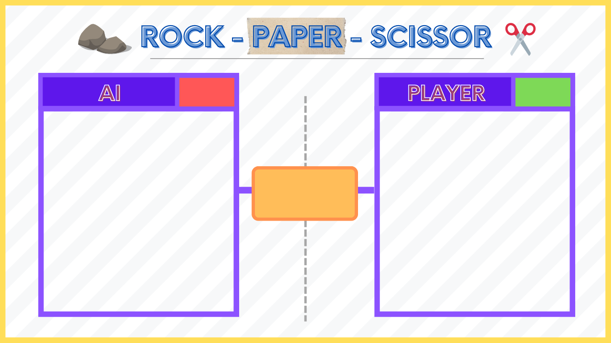

# Stone-Paper-Scissor-OpenCV

# 🤖 Rock-Paper-Scissors Game with Hand Gesture Recognition ✋🖐️

Welcome to the **Rock-Paper-Scissors** game powered by **Hand Gesture Recognition**! 🎮 This fun and interactive game allows you to play **Rock-Paper-Scissors** against an AI, using your hand gestures for control! ✨

---

## 💡 About the Project

This project uses **OpenCV** and **HandTracking** to detect hand gestures and map them to the classic Rock-Paper-Scissors game moves. The AI plays randomly, and the game is played in real-time using your webcam! 🎥

- **Rock** 🪨: Represented by a closed fist (no fingers up)
- **Paper** 📄: Represented by an open hand (all fingers up)
- **Scissors** ✂️: Represented by two fingers (index and middle) extended

---

## 🎯 Features

- **Hand Gesture Detection**: The game detects your hand gestures using a webcam, so you don't need a mouse or keyboard! 👏
- **AI Opponent**: Face off against the AI, which randomly picks Rock, Paper, or Scissors! 🤖
- **Score Display**: Keep track of your score and the AI's score as the game progresses! 📊
- **Exciting Gameplay**: Play and have fun with the classic Rock-Paper-Scissors challenge! 🎉

---

## 🧠 How It Works

1. The game waits for you to show one of the hand gestures: Rock 🪨, Paper 📄, or Scissors ✂️.
2. The AI randomly selects a move.
3. The result of the round is shown with a score update: **Player** vs **AI**! 🏆
4. The game continues until you exit by pressing 'q' on your keyboard. ❌

---

## 🏆 Screenshots

### 📸 Game in Action:

---

## 🧑‍🤝‍🧑 Contributions

This project was created with 💖 by [Ridham Garg](https://github.com/RidhamGarg).

Feel free to contribute to this project! 🌱

---

## 🌍 Let's Connect!

- 🌐 Explore my other projects: [GitHub](https://github.com/irythmgarg)

---

## 🎉 Enjoy the Game! ✨

Have fun playing Rock-Paper-Scissors, and may the best gesture win! 🙌👊✋
